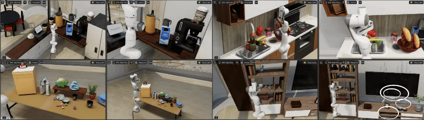

I am currently pursuing my M.Sc at SusTech's [RcvLab](https://rcvlab.eee.sustech.edu.cn/), under the guidance of Prof. [Hong Zhang](https://faculty.sustech.edu.cn/?tagid=zhangh33&iscss=1&snapid=1&orderby=date&go=2&lang=en). Prior to this, I earned my B's degree from the [HeFei University of Technology](http://irmv.sjtu.edu.cn/) of Science and TEchnology.

My primary research interests encompass **social aware task plannig**, **scene understanding for robot**, **human-robot interaction** and **robot learning**. The ultimate goal is to develop agents that can perceive, understand, and interact with the physics world with human in the same level of intelligence as human.

<!-- If you have any good ideas or cooperation intentions, please feel free to contact me at 12232112@mail.sustech.edu.cn :) -->
  

Publication Brief View
======
<html>

<table style="width:100%;border:0px;border-spacing:0px;border-collapse:separate;margin-right:auto;margin-left:auto;">
  <tr onmouseout="nightsight_stop()" onmouseover="nightsight_start()">
    <td style="padding:10px;width:40%;vertical-align:middle;border-left-style:none;border-bottom-style:none;border-top-style:none;border-right-style:none">
      
    </td>
    <td style="padding:20px;width:75%;vertical-align:middle;border-left-style:none;border-bottom-style:none;border-top-style:none;border-right-style:none">
      <papertitle>GraspGPT: Leveraging Semantic Knowledge from a Large Language Model for Task-Oriented Grasping</papertitle>
       
      Tang C, Huang D, <strong>Ge W</strong>, et al.
       
      <em>Published in 2023 IEEE Robotics and Automation Letters (RAL)</em> 
      <a href="https://arxiv.org/abs/2307.13204" class="custom-link arxiv">arxiv</a>
      <a href="https://sites.google.com/view/graspgpt/" class="custom-link web">site</a>
      <a href="https://www.youtube.com/watch?v=qq0DMdHRw1E" class="custom-link video">video</a>
    </td>
  </tr>
</table>

  <table style="width:100%;border:0px;border-spacing:0px;border-collapse:separate;margin-right:auto;margin-left:auto;">
        <tr onmouseout="nightsight_stop()" onmouseover="nightsight_start()">
          <td style="padding:10px;width:40%;vertical-align:middle;border-left-style:none;border-bottom-style:none;border-top-style:none;border-right-style:none">
            
          </td>
          <td style="padding:20px;width:75%;vertical-align:middle;border-left-style:none;border-bottom-style:none;border-top-style:none;border-right-style:none">
              <papertitle>Commonsense Scene Graph-based Target Localization for Object Search</papertitle>
             
              <strong>Zhijian Qiao</strong>, Haoming Huang, Chuhao Liu, Shaojie Shen, Fumin Zhang, Huan Yin
             
            <em>Under review.</em> 
            <a href="https://arxiv.org/abs/2405.03969">arxiv</a>
          </td>
        </tr>
  </table>

    <table style="width:100%;border:0px;border-spacing:0px;border-collapse:separate;margin-right:auto;margin-left:auto;">
          <tr onmouseout="nightsight_stop()" onmouseover="nightsight_start()">
            <td style="padding:10px;width:40%;vertical-align:middle;border-left-style:none;border-bottom-style:none;border-top-style:none;border-right-style:none">
              
            </td>
            <td style="padding:20px;width:75%;vertical-align:middle;border-left-style:none;border-bottom-style:none;border-top-style:none;border-right-style:none">
                <papertitle>Speak the Same Language: Global LiDAR Registration on BIM Using Pose Hough Transform
                </papertitle>
               
                <strong>Zhijian Qiao</strong>, Haoming Huang, Chuhao Liu, Shaojie Shen, Fumin Zhang, Huan Yin
               
              <em>Under review.</em> 
              <!-- <a href="https://arxiv.org/abs/2405.03969">arxiv</a> -->
            </td>
          </tr>
    </table>
</html>

Skill
======
## SLAM + semntic map building

<html>
    <table style="width:100%;border:0px;border-spacing:0px;border-collapse:separate;margin-right:auto;margin-left:auto;">
          <tr onmouseout="nightsight_stop()" onmouseover="nightsight_start()">
            <td style="padding:10px;width:40%;vertical-align:middle;border-left-style:none;border-bottom-style:none;border-top-style:none;border-right-style:none">
              
            </td>
            <td style="padding:20px;width:75%;vertical-align:middle;border-left-style:none;border-bottom-style:none;border-top-style:none;border-right-style:none">
                <papertitle>Speak the Same Language: Global LiDAR Registration on BIM Using Pose Hough Transform
                </papertitle>
               
                <strong>Zhijian Qiao</strong>, Haoming Huang, Chuhao Liu, Shaojie Shen, Fumin Zhang, Huan Yin
               
              <em>Under review.</em> 
              <a href="https://arxiv.org/abs/2405.03969">arxiv</a>
            </td>
          </tr>
    </table>
</html>

## Isaacsim + grasping

<video src="../images/isaac.mp4" style="width:100%; height:auto;" controls autoplay loop muted playsinline></video>

Selected Honors
======
* **Outstanding Graduates**, 2022, SJTU
* **Most Influential Graduates**, 2019, NEU
* **Champion**, the 17th China University Robot Competition, 2018 [[link]](http://www.cnrobocon.net/#/)
* **Runner-up**, The ABU Asia-Pacific Robot Contest, 2018 [[link]](https://en.wikipedia.org/wiki/ABU_Robocon)
* **Champion**, the 16th China University Robot Competition, 2017 [[link]](http://www.cnrobocon.net/#/)
* **Best Engineering**, The ABU Asia-Pacific Robot Contest, 2017 [[link]](http://www.aburobocon.net/)

