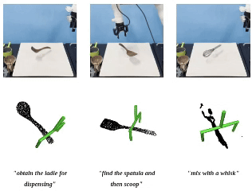
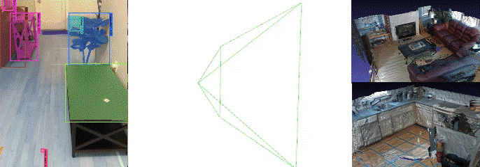

I am currently pursuing my M.Sc at SUSTech's [RCVLab](https://rcvlab.eee.sustech.edu.cn/), under the guidance of Prof. [Hong Zhang](https://faculty.sustech.edu.cn/?tagid=zhangh33&iscss=1&snapid=1&orderby=date&go=2&lang=en). Prior to this, I earned my Bachelor's degree in Computer Science and Technology from Hefei University of Technology.

My primary research interests encompass **social aware task plannig**, **scene understanding for robot**, **human-robot interaction** and **robot learning**. The ultimate goal is to develop agents that can perceive, understand, and interact with the physics world with human in the same level of intelligence as human.

<!-- If you have any good ideas or cooperation intentions, please feel free to contact me at 12232112@mail.sustech.edu.cn :) -->
  

📝Publication Brief View
======
<html>

<table style="width:100%;border:0px;border-spacing:0px;border-collapse:separate;margin-right:auto;margin-left:auto;">
      <tr onmouseout="nightsight_stop()" onmouseover="nightsight_start()">
        <td style="padding:10px;width:40%;vertical-align:middle;border-left-style:none;border-bottom-style:none;border-top-style:none;border-right-style:none">
          
        </td>
        <td style="padding:20px;width:75%;vertical-align:middle;border-left-style:none;border-bottom-style:none;border-top-style:none;border-right-style:none">
            <papertitle>Commonsense Scene Graph-based Target Localization for Object Search</papertitle>
           
            <strong>Wenqi Ge</strong>, Chao Tang, Hong Zhang
           
          <em>Accepted by as <strong>Oral</strong> in 2024 IEEE/RSJ International Conference on Intelligent Robots and Systems (IROS)</em> 
          <a href="https://arxiv.org/abs/2404.00343" target="_blank" class="custom-link arxiv">arxiv</a>
          <a href="https://sites.google.com/view/csg-os"  target="_blank" class="custom-link web">site</a>
          <a href="https://www.youtube.com/watch?v=W_fRpC8F86Y" target="_blank" class="custom-link video">video</a>
        </td>
      </tr>
</table>

<table style="width:100%;border:0px;border-spacing:0px;border-collapse:separate;margin-right:auto;margin-left:auto;">
  <tr onmouseout="nightsight_stop()" onmouseover="nightsight_start()">
    <td style="padding:10px;width:40%;vertical-align:middle;border-left-style:none;border-bottom-style:none;border-top-style:none;border-right-style:none">
      
    </td>
    <td style="padding:20px;width:75%;vertical-align:middle;border-left-style:none;border-bottom-style:none;border-top-style:none;border-right-style:none">
      <papertitle>GraspGPT: Leveraging Semantic Knowledge from a Large Language Model for Task-Oriented Grasping</papertitle>
       
      Chao Tang, Dehao Huang, <strong>Wenqi Ge</strong>, Weiyu Liu, Hong Zhang
       
      <em>Published in 2023 IEEE Robotics and Automation Letters (RAL)</em> 
      <a href="https://arxiv.org/abs/2307.13204" target="_blank" class="custom-link arxiv">arxiv</a>
      <a href="https://sites.google.com/view/graspgpt/"  target="_blank" class="custom-link web">site</a>
      <a href="https://www.youtube.com/watch?v=qq0DMdHRw1E" target="_blank" class="custom-link video">video</a>
    </td>
  </tr>
</table>

</html>

💡Developed System:
======
<html>
  
<!--  -->
<h2 id="slam-map-building">SLAM + semntic mapping</h2>

<h2 id="grasp-ros">Isaacsim + Ros + grasping</h2>

<video src="../images/isaac1.mp4" style="width:100%; height:auto;" controls autoplay loop muted playsinline></video>

  

  

    For more fancy ongoing works with demo, please have a look at
    <a href="https://wenqi-ge.github.io/portfolio/" target="_blank">my projects</a>.
  

</html>

🍻Selected Honors
======
* **Outstanding Graduates**, 2022, HFUT
* **Runner-up**, the 19th & 20th National College Students’ Robotics Competition **ROBOMASTER** 2021 Regional Tournament (Northern Region), 2020-2021 HFU
* **Champion**, The National Undergraduate Engineering Training Competition (Anhui Province Divison), 2021
* **Runner-up**, The National College Computer Competency Challenge, C++ Programming Competition (East China Divison)
* **Champion**, Anhui Province Robotics Competition - Microcontroller and Embedded Systems Category, 2021
* **Champion**, Anhui Province College IoT Application Innovation Competition, 2021

