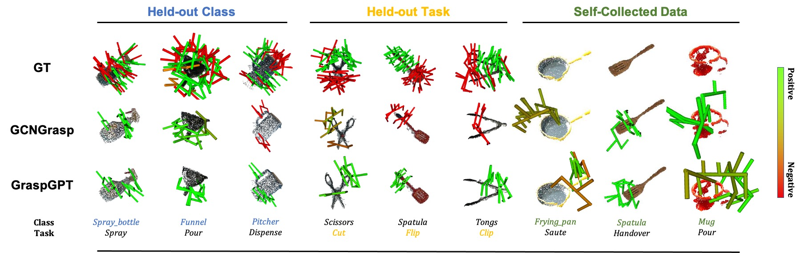
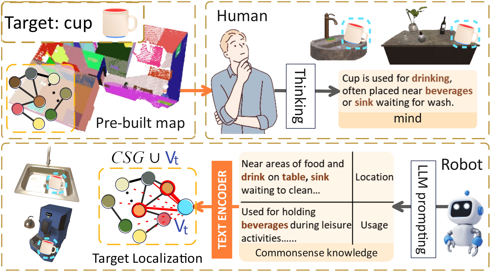
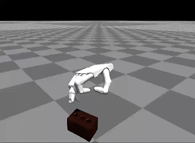



<!-- 
  
 -->

<html>

<h1 id="work1" class="page1" >Task Oriented Grasp (TOG) Generation generalized by LLM</h1>
<a href="https://arxiv.org/abs/2404.00343" target="_blank" class="custom-link arxiv">RAL2023: Pdf</a>
<a href="https://sites.google.com/view/csg-os"  target="_blank" class="custom-link web">site</a>
<a href="https://www.youtube.com/watch?v=W_fRpC8F86Y" target="_blank" class="custom-link video">video</a>

Abstract: Task-oriented grasping (TOG) refers to the problem of predicting grasps on an object that enable subsequent manipulation tasks. To model the complex relationships between objects, tasks, and grasps, existing methods incorporate semantic knowledge as priors into TOG pipelines. However, the existing semantic knowledge is typically constructed based on closed-world concept sets, restraining the generalization to novel concepts out of the pre-defined sets. To address this issue, we propose GraspGPT, a large language model (LLM) based TOG framework that leverages the open-end semantic knowledge from an LLM to achieve zero-shot generalization to novel concepts. We conduct experiments on Language Augmented TaskGrasp (LA-TaskGrasp) dataset and demonstrate that GraspGPT outperforms existing TOG methods on different held-out settings when generalizing to novel concepts out of the training set. The effectiveness of GraspGPT is further validated in real-robot experiments. 

  

<h1 id="work2" class="page1" >Commonsense Scene Graph-based Target Localization for Obj Search</h1>

<a href="https://arxiv.org/abs/2404.00343" target="_blank" class="custom-link arxiv">IROS2024-Oral: Pdf</a>
<a href="https://sites.google.com/view/csg-os"  target="_blank" class="custom-link web">site</a>
<a href="https://www.youtube.com/watch?v=W_fRpC8F86Y" target="_blank" class="custom-link video">video</a>

This work focuses on the problem of locating frequently moved objects (target objects) in an indoor environment where a home assistant robot has already explored and mapped the stationary objects (e.g. wall, furnitures) indoor. Known the locations of furniture and the overall structure of the search environment, the challenge is to efficiently search for target objects that are not explicitly known to the robot without exploring irrelevant areas. Since the placement of objects is often influenced by their usage and relationships with the surrounding environment—concepts derived from human commonsense—we model the search environment as a scene graph. Using large language models (LLMs), we encode commonsense knowledge into this graph, creating a Commonsense Scene Graph (CSG), where nodes and links represent entities and their relationships. We formulate the object search as a link prediction problem in the CSG and develop a custom-designed GNN-Transformer model to learn the potential relationships between target objects and their known surroundings, enabling efficient and context-aware object search.

  

<!-- <h1 id="work3" class="page1" >Continual Learning for Obj Search with Commonsense and User Habits</h1> -->

<h1 id="work4" class="page1" >Commonsense and Physics-Aware Planning for Target Search</h1>

<a  target="_blank" class="custom-link arxiv">Writing for RAL</a>
<a  target="_blank" class="custom-link arxiv">Intern project in Tecent RoboticsX</a>

Formulated the object search problem as a POMDP and developed a pipeline that leverages VLMs to propose object likely locations, using physics-based simulations to evaluate the feasibility of these proposals. Designed realistic scenes in IsaacSim with diverse daily objects, evaluating the framework’s performance in both simulation and real-world experiments to demonstrate its effectiveness.

<video src="../images/t11.mp4" style="width:100%; height:auto;" controls autoplay loop muted playsinline></video>

  

<h1 id="work5" class="page1" >Human Intention Aware Robot Navigation with LLM-Adapted RL</h1>
<a  target="_blank" class="custom-link arxiv">Master thesis</a>

Developed a framework that enables robots to perform user-friendly path planning by considering human intentions. For instance, when a person is watching TV, the robot plans to avoid the area between the user and the TV to minimize disruptions and respect the user’s activities. Built upon an existing RL framework for social navigation by adding a scene understanding module that maps human-environment interactions through feature maps and LLM-generated descriptions, enabling human intention-aware robot navigation.

<video src="../images/nav-ma.mp4" style="width:100%; height:auto;" controls autoplay loop muted playsinline></video>

  

<!-- <h1 id="work6" class="page1" >Just a funny demo for a model of dexterous grasping with tactile</h1> -->
<!-- <a  target="_blank" class="custom-link arxiv">Intern collaboration</a> -->

<!-- 

Our judge to it be like: It is not robotic, it is drama trick

 -->

</html>
